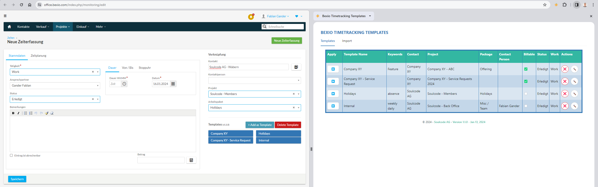
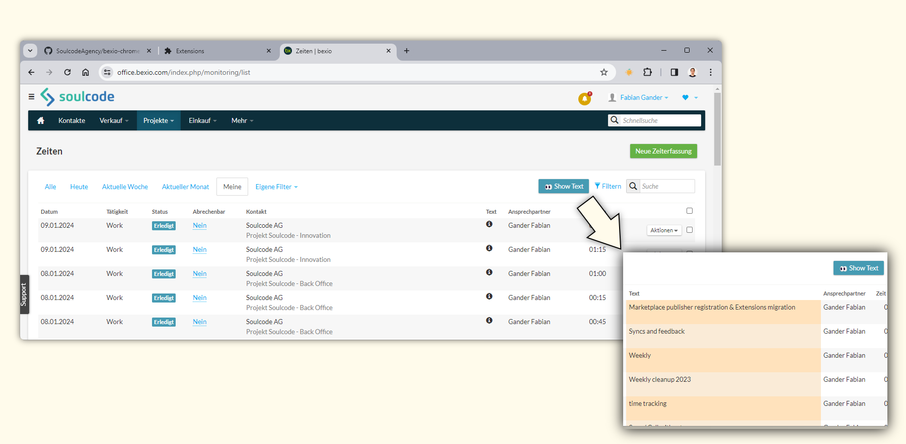

# bexio Time Tracking Templates — Chrome extension

A Chrome (Manifest V3) extension that augments [bexio](https://office.bexio.com)'s time tracking pages:

- **Templates** — save the time tracking form as a template and re-apply it with one click.
- **ManicTime import** — paste a [ManicTime](https://www.manictime.com/) timesheet into the browser side panel and book the entries into bexio semi-automatically.
- **Tooltip replacement** — replace bexio's tooltip icons in list views with the actual text.

Install it from the Chrome Web Store:
[bexio Time Tracking Templates](https://chromewebstore.google.com/detail/bexio-timetracking-templa/nbmjdligmcfaeebdihmgbdpahdfddlhm)



## Feature overview

### On the bexio time tracking page

Clicking the extension icon brings you to the bexio time tracking page.

- On the time tracking page you can save the current form data as a template.
- Saved templates appear as buttons below the form — one click fills the form automatically.
- Templates can be deleted again, and filtered if you have many of them.

### Side panel (browser)

Clicking the extension icon on the bexio time tracking page opens the extension's side panel
(you can also open it via the browser's side panel selection):

- **Templates tab**
  - Shows the saved templates and their content.
  - Templates can be applied, edited and deleted from here.
  - While a template is being applied, a loader screen blocks interactivity until auto-filling is done.
  - You can add **keywords** to templates — these are used by the import feature's auto-mapper.
- **Import tab**
  - Import [ManicTime](https://www.manictime.com/) timesheet data from the clipboard and select which template to use per entry.
  - Clicking an entry's ▶️ button **automatically** fills the time tracking page, applying the selected template if one
    is set, plus the entry's **time and date** and the **billable** checkbox where the entry provides them.
  - The **auto-mapper** tries to find the right template for each entry — it checks the template **keywords** as well as
    other template fields.

### Tooltip replacement

bexio hides some cell content behind small tooltip icons. Because that content is often important, the extension can
replace those icons with the real text.

On the supported pages a **"Text mode / Popover mode"** button is placed in the top right corner next to the
"Quick find". With "Text mode" enabled, tooltips are automatically replaced with their content on:

- Projects → Time tracking
- Projects → Projects → Project XY → Times
- Projects → Projects → Project XY → Work packages → Work package XY → Time tracking
- Sales → Invoices → Invoice XY → More items → Tracked time



## How to use the ManicTime feature

[ManicTime](https://www.manictime.com/) can generate a timesheet of your worked time. The extension helps you go over
those entries and book them in bexio through the UI — you keep control of what happens, but the form filling is
automated.

- The only supported export language is currently **English**.
- Create the export via Timesheet → Generate Report → `Copy to clipboard`.
- Make sure you selected `Time format`, not `Decimal format`.
- Include the tags as columns — at least `Tag 1` is required.
- Check `Include Notes` if you want to use the notes as descriptions.
- Include `Billable` as a column to get a billable flag per time entry (overrides the template's flag).

## Development

### Prerequisites

- Node.js — the version in [.nvmrc](.nvmrc) (`nvm use`).
- PowerShell (`pwsh`) — the build is orchestrated by [Build.ps1](Build.ps1). This is a Windows-first repo, but CI runs
  the same scripts on Ubuntu with the preinstalled `pwsh`.

### Repository layout

An npm workspaces monorepo; the sub-projects live in `packages/`:

| Package                     | What it is                                                                                           |
| --------------------------- | ---------------------------------------------------------------------------------------------------- |
| `packages/chrome-extension` | The MV3 extension: content scripts, service worker, manifest. Vite + `@crxjs/vite-plugin`, plain TS. |
| `packages/sidePanel-import` | The React 19 + antd app rendered in Chrome's side panel. Vite + `@vitejs/plugin-react`.              |
| `packages/shared`           | TypeScript-only library (no build step) consumed by both other packages.                             |

Both Vite builds emit into the repo-root `unpacked/` directory (the loadable unpacked extension); `dist/` holds the
zipped package for the store upload. Both are git-ignored and recreated by builds.

### Setup and build

```bash
npm run npm:installProject
```

(equivalent to `npm i --workspaces --include-workspace-root`; CI uses `npm run npm:ciProject`)

- `npm run build:project` — production build of both packages into `unpacked/`.
- `npm run build:project -- -Development` — development-mode build (non-minified).
- `npm run build:newExtensionRelease` — production build **plus** zip to `dist/bexio-chrome-extension.zip`.
- `npm run build:cleanup` — remove `dist/` and `unpacked/`.

To load the extension locally: build, then Chrome → Extensions → **Load unpacked** → select the `unpacked/` folder.

### Tests and checks

- `npm test` — full Vitest suite (includes a slow build smoke test that shells out to `Build.ps1`).
- `npm run test:fast` — Vitest without the `*.slow.test.ts` files.
- `npm run test:watch` — Vitest watch mode.
- `npm run test:e2e` — Playwright smoke + behaviour specs in `e2e/`. Locally this needs
  `npx playwright install chromium` once and a built `unpacked/`; it opens a visible Chromium window because MV3
  service workers don't surface headlessly.
- `npm run typecheck` — TypeScript across all workspaces (no emit — Vite does the transpiling).
- `npm run lint -w @bexio-chrome-extension/side-panel-import` — ESLint (side panel only).

GitHub Actions runs typecheck, build, tests and the e2e specs on every PR.

### Architecture docs

Detailed, behaviour-pinned docs live in [docs/architecture/](docs/architecture) — read the relevant one before changing
the corresponding code:

- [storage.md](docs/architecture/storage.md) — the `chrome.storage.local` model and template shape.
- [form-layer.md](docs/architecture/form-layer.md) — how the bexio jQuery/select2 form is filled, and the messaging contract.
- [tooltip-replacement.md](docs/architecture/tooltip-replacement.md) — the tooltip→text feature.
- [build-and-release.md](docs/architecture/build-and-release.md) — workspace layout, `Build.ps1`, Vite quirks.
- [testing.md](docs/architecture/testing.md) — the test layers and the manual walkthrough checklist.
- [publishing.md](docs/architecture/publishing.md) — the release paths and the Chrome Web Store workflow.

## Releases

Two paths, described in [RELEASE.md](RELEASE.md):

- **Automatic (preferred):** conventional commits on `main` drive [release-please](https://github.com/googleapis/release-please);
  merging its Release PR tags, builds and publishes to the Chrome Web Store via GitHub Actions.
- **Manual (fallback):** `npm run createRelease` handles version bump, build, changelog (git-cliff), commit and tag —
  the zip must then be uploaded via the Chrome Web Store dev console.

## FAQ

See [FAQ.md](FAQ.md)

## Privacy

See [PRIVACY.md](PRIVACY.md)

## License

[AGPL-3.0](LICENSE)
